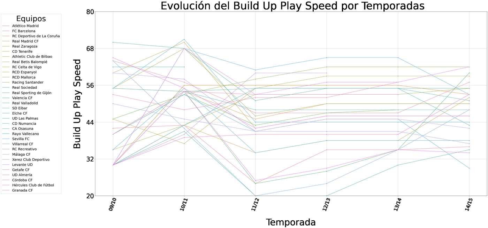
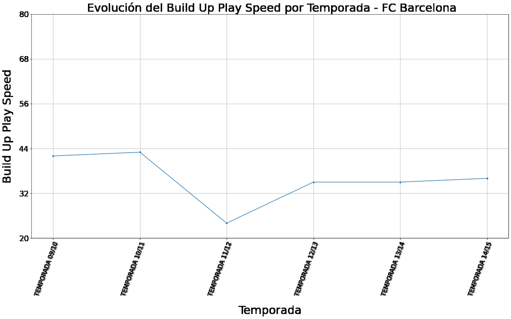
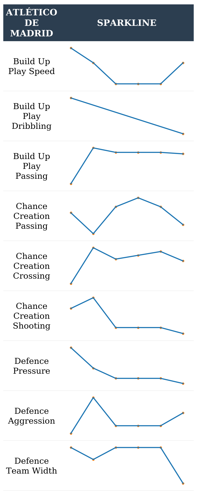
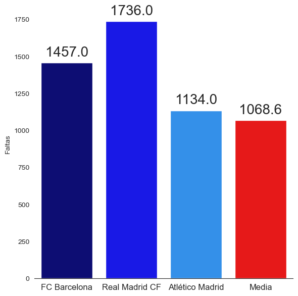

# La Liga — Performance and Tactical Analysis (2008–2016)

Exploratory data analysis of eight seasons of the Spanish first division, built from a raw
match-event dataset. The project reconstructs official league standings from scratch, tracks how
clubs' tactical profiles evolved season by season, and generates per-club visual report cards.

Built as **Projecte I** at ETSEIB (Universitat Politècnica de Catalunya), Barcelona.

**Scope:** 3,040 matches · 8 seasons (2008/09 – 2015/16) · 33 clubs · ~50 MB of raw data

---

## What this project does

### 1. Parsing match events out of embedded XML

The raw match table stores every match event — goals, shots on and off target, fouls, cards and
corners — as **XML markup nested inside individual CSV cells**. Before any analysis was possible,
these had to be parsed and flattened into 12 numeric per-match columns (six event types × home/away).

This was the single largest engineering effort in the project.

### 2. Reconstructing league standings

Starting from nothing but raw scorelines, the pipeline derives wins, draws, losses, points and goal
difference, concatenates each club's home and away records, aggregates by club, and applies La Liga's
official tiebreak ordering (points → wins → goal difference) to reproduce the final table for each
of the eight seasons.

Output: [`data/processed/`](data/processed) — one CSV per season plus an eight-season aggregate.

### 3. Tracking tactical evolution

Team attribute data (build-up play, chance creation and defensive metrics) was merged in, gaps
padded for clubs absent in given seasons, and the table reshaped from long to wide format — one
column per metric per season — to make trends plottable across time.



Nine tactical metrics were charted league-wide and per club:



### 4. Per-club tactical report cards

A custom HTML reporting tool renders each metric's history as a matplotlib **sparkline**, writes it
to an in-memory buffer, base64-encodes it, and injects it into a styled HTML table — producing a
compact visual profile for any club in the dataset.

<p align="center">
  
</p>

### 5. Comparative performance analysis

Clubs present in all eight seasons (304 matches — i.e. never relegated) were isolated, and the top
three benchmarked against the bottom three and the league average across points, wins, goals
and disciplinary record.

<p align="center">
  
</p>

---

## Repository structure

```
├── notebooks/
│   ├── 01_season_tables.ipynb              Event parsing + league table reconstruction
│   ├── 02_team_attributes_prep.ipynb       Merging and cleaning team attribute data
│   ├── 03_tactical_trends.ipynb            Reshaping + tactical trend charts
│   ├── 04_tactical_report_sparklines.ipynb HTML report generator with sparklines
│   └── 05_club_profiles.ipynb              Comparative club analysis
├── data/
│   ├── team_sp.csv                         Club reference table
│   ├── team_atts_sp.csv                    Tactical attributes by club and date
│   └── processed/                          Reconstructed league tables (CSV)
└── images/                                 Charts exported from notebook outputs
```

## Running it

```bash
pip install -r requirements.txt
jupyter lab
```

Notebooks are numbered in execution order. Note that `01_season_tables.ipynb` depends on the raw
match file, which is not included (see below) — the remaining notebooks run from the processed data
in this repository.

## A note on the data

The raw dataset was provided by the university for coursework. Its original provenance and
licensing terms are not known to us, so the ~50 MB raw match file is **not redistributed here**.
The processed outputs in `data/processed/` are derived aggregates produced by this analysis.

## Scope and limitations

This is a **descriptive and exploratory** analysis. No predictive or statistical inference model was
built — no regression, classification or forecasting. The work focuses on data extraction,
reconstruction and visualisation.

Some notebooks contain absolute file paths from the original development machines and are kept as
submitted, for authenticity.

## Tools

Python · pandas · NumPy · Matplotlib · Seaborn · Jupyter

## Authors

Two-person project.

- Daniel Alonso Roquet
- *(collaborator)*
